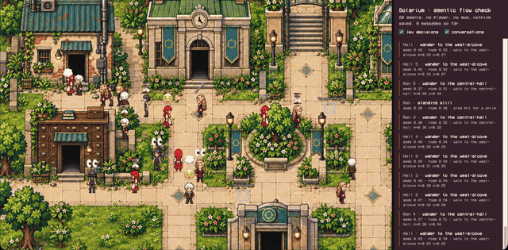

# Jev Town



**The first Jev-based AI simulation system.**

Jev Town is a game engine where the characters are driven by AI, not scripts. Every agent in the
world decides what to do next through two kinds of models working together:

- **Jev**, a System One model, makes the fast, structured decisions: whether to seek someone out,
  who to go to, where to wander, how long to wait. The engine offers the options; Jev chooses
  within them, so an illegal move is never possible.
- **An LLM** does the language work: conversations between agents, memory, and what each agent
  believes about the world.

Drop a cast of agents into a pixel-art room and watch what emerges — nobody is playing. The whole
simulation runs in a single browser tab; a small local proxy holds your model keys so the browser
never sees them. It is an MVP and still taking shape.

## Coming soon

We are building a game on top of this engine: a pixel-art narrative world where every character
you meet is a Jev-driven agent with a life of its own. Star the repository to follow along.

## Installation

> The Jev demo currently lives on `feat/jev-demo-solarium` until it merges to `main`.

Requires **Node.js 22 LTS (22.22.1 or a newer patch)** and npm.

1. Install dependencies:

   ```sh
   npm ci
   ```

2. Create `.env.local` in the repository root with your model credentials:

   ```sh
   # LLM (any OpenAI-compatible endpoint)
   LLM_API_URL=https://your-openai-compatible-endpoint/v1
   LLM_API_KEY=...
   LLM_MODEL=...
   LLM_EMBEDDING_API_URL=https://your-embedding-endpoint/v1
   LLM_EMBEDDING_API_KEY=...
   LLM_EMBEDDING_MODEL=...

   # Jev (System One decider)
   JEV_API_KEY=...
   VITE_ACTION_DECIDER=jev
   ```

   `OPENAI_API_KEY`, `TOGETHER_API_KEY`, and a local Ollama host also work for the LLM. Leave out
   `VITE_ACTION_DECIDER` to let the LLM make every decision instead of Jev.

3. Run the demo:

   ```sh
   npm run play:demo
   ```

4. Open `http://localhost:5173/ai-town/` and watch the agents go. Set `VITE_DEMO_AGENTS=n` in
   `.env.local` to change the cast size (five by default, up to fifty).

Every decision and every line of dialogue is a model call, so a large cast costs more. The proxy
stops after 2000 model calls per run as a spend backstop; restart it to continue.

## License and credits

This project started from [a16z-infra/ai-town](https://github.com/a16z-infra/ai-town) and is
directly inspired by it: the agent loop, the simulation shape, and parts of the client all trace
back to that work, and the project still uses assets from it. Upstream code is © 2023 a16z-infra
and distributed under the [MIT License](LICENSE); attribution for the initial snapshot belongs to
the upstream authors.

Original code and modifications by NevaMind-AI contributors are likewise MIT licensed, with
copyright retained by each contributor. Story, art, music, and third-party assets may carry their
own licenses, which take precedence where they apply; the code license grants no rights over player
game data.

Upstream assets and foundational work:

- Map tiles: [George Bailey](https://opengameart.org/content/16x16-game-assets) and
  [hilau](https://opengameart.org/content/16x16-rpg-tileset).
- Original art: [ansimuz](https://opengameart.org/content/tiny-rpg-forest).
- UI assets: [Mounir Tohami](https://mounirtohami.itch.io/pixel-art-gui-elements).
- The upstream proof of concept was based on
  [phaser3-simple-rpg](https://github.com/pierpo/phaser3-simple-rpg).
- Character rendering uses [PixiJS](https://pixijs.com/).
