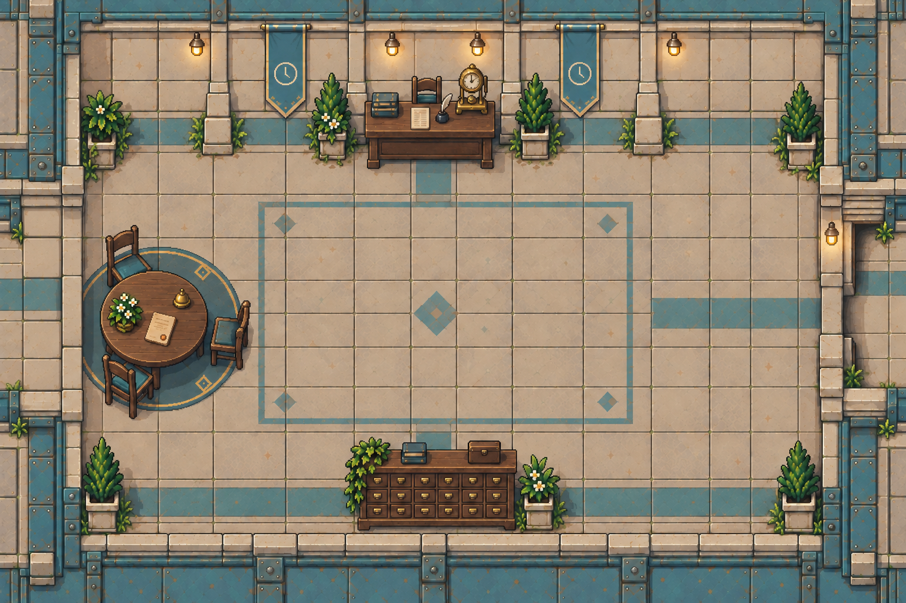

# civic-mediation · 房间底图与布局

- [`background.png`](../../../public/assets/civic-mediation/background.png)：1536 ×
  1024 空背景。移除桌椅、圆桌与地毯、档案柜和盆栽；保留地面嵌纹与侧面通道。
- [`layout.json`](../../../public/assets/civic-mediation/layout.json)：`sourceLayout`
  原样保存来源地图的出口、到达点、出生点与事件锚点，坐标为原图像素。
- `room-layout.png`：原始地图，用于建筑、透视和后续物件取材参考。

使用 gpt-image-2 补绘隐藏墙面与地面，仅在指定修补区域采用生成内容；范围外保持原始像素。本地批处理记录为合成完成、待视觉复核；本次收录未重新进行视觉验收。隐藏区域属于推断重建，尚未进行游戏内通行验收。

`sourceLayout` 是来源资料，不是游戏运行时配置。其 `image`
指向原始地图；旧物件碰撞和遮挡范围需要在空场景接入时调整，事件锚点不代表任务已实现。跨房间按
`target` 与 `targetExit` 查找连接，落点取目标出口的 `arrival`。

来源：`project-myrmidon-map-prototype/source/imagegen-v2/assets/maps/civic-mediation.png` 与
`source/imagegen-v2/world.json`。制作提示词、候选、修补遮罩和对照图保存在本地
`art/map-study/civic-mediation/`。
