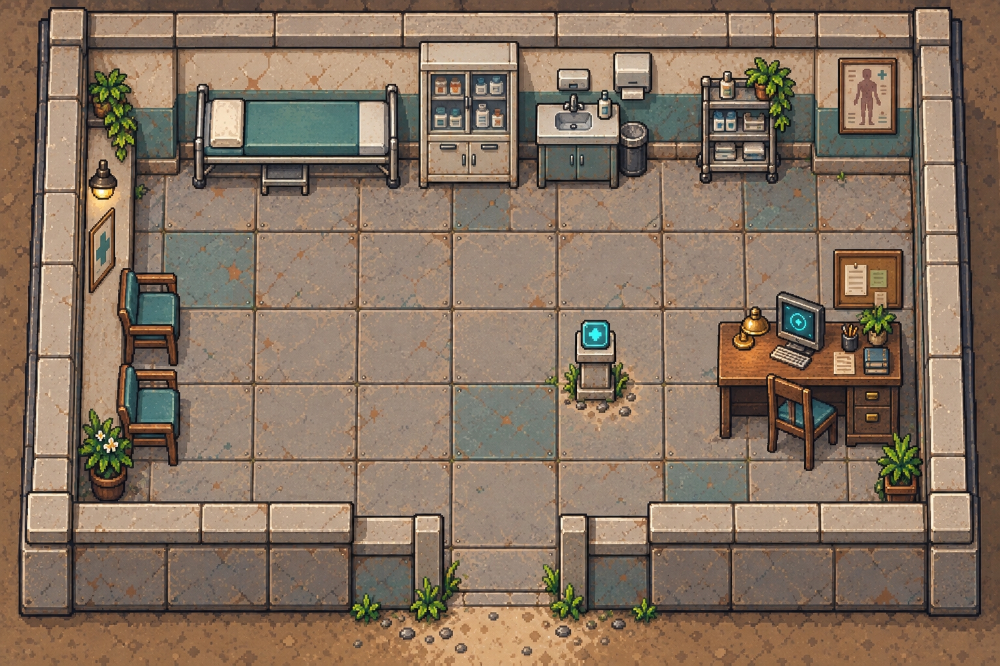
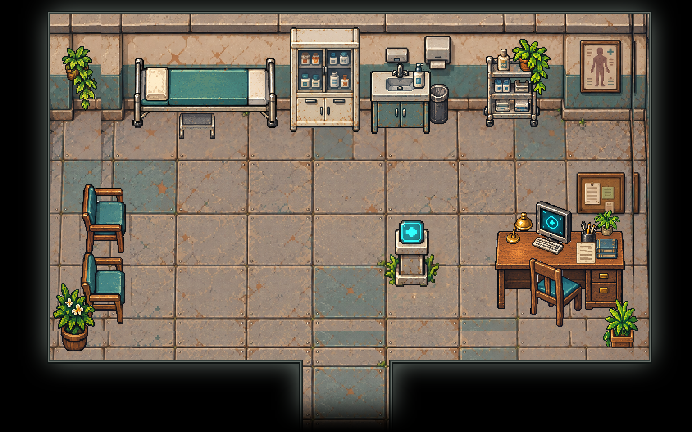

# 基础诊所 · 独立物件与原位装修

`low-clinic`
接入24件独立PNG，按原图的家具分布、朝向和可见结构还原。原始房间图和围墙版空背景保持原文件；围墙与黑框两套布局共用独立物件。

## 拆分内容

| 区域         | 件数 | 内容                                                         |
| ------------ | ---- | ------------------------------------------------------------ |
| 诊疗区       | 2    | 横向诊疗床、床前脚踏                                         |
| 药品与清洁区 | 7    | 药柜、水槽柜、皂液瓶、垃圾桶、药架、架上瓶子、架上盆栽       |
| 等候与角落   | 5    | 西北垂藤、两把等候椅、西南花盆、东南花盆                     |
| 办公区       | 9    | 办公桌、椅子、显示器、键盘、台灯、笔筒、纸张、书本、桌面盆栽 |
| 医疗设备     | 1    | 青色十字终端与石质底座及附着绿植                             |

药柜和药架的内部存货随柜架保留；柜顶物件独立输出。床架、床品与枕头为同一诊疗床，水槽、龙头和柜体为同一清洁设施。固定墙灯、标识和分配器仍属于背景。

正式PNG唯一存于 [`public/assets/low-clinic/`](../../../public/assets/low-clinic/)。两套
`layout*.json` 记录各物件位置、尺寸、脚点、图层深度和占地来源；`overview.png`
由正式PNG回拼，未叠加人物。

## 制作依据

依照 `.agents/skills/map-asset-extraction/SKILL.md`
从1536×1024原图矩形裁图逐件请求 gpt-image-2。首轮24次，办公桌为校准桌面纵深定向重试1次，共25次图像请求。原图来源为
`project-myrmidon-map-prototype/source/imagegen-v2/assets/maps/low-clinic.png`；原始裁图、提示词、生成结果与处理记录保留于本地
`art/map-study/low-clinic/atomic-redraw/`。

仅等比缩放与平移，按家具可见宽度、椅柱高度和桌／药架的落地基准校准。床前小凳遮住的框架、椅子遮住的桌腿与桌沿、盆栽遮住的药架立柱及花盆边缘为推断补全；两盆垂藤内部盆体和前墙遮住的盆底证据较少。生成结果保留来源风格与布局，不是原像素的逐像素复制。

已查看24件原图、浅底、深底及原位叠放，清理椅背和叶片间白底；药架的封闭空隙按已查看区域去底，保留白色药瓶、标签、陶瓷、金属高光与花瓣。

## 接入与切换

黑框内沿扩为 `[112,32,1440,800)`，南通道为
`[672,800,864,960)`，以容纳原等候椅和角落盆栽的位置。新增窄边和底边使用邻近空地板条带补接，需在实际缩放下继续核对接缝。地图仍为48×30格，现有相机下缘对应通道末端。

启用来源布局的9个家具占地区域，另补两盆落地植物占地。桌面及架上物件沿用 `objects[].depth`
控制相对支承物的绘制顺序，不改变公共厨房配置。运行 `python scripts/export-room-maps.py` 导出；在
`art/room-maps.json` 为诊所选择 `layout.json` 可切回带家具的围墙版。

需开启新时间线加载家具碰撞与新边界。本轮只恢复显示与占地，尚未增加治疗、取药、设备操作、入座或对白。

## 核对范围

正式PNG与制作透明PNG尺寸和RGBA像素一致，已查看整房原图／围墙回拼／黑框回拼。导出器通过26房间、54个单向出口、到达锚点及32个NPC实例的占位和出口可达校验。

未实机试玩或逐像素手工精修，未运行Jest、完整测试或构建。贴家具行走、人物遮挡与地板接缝仍需游戏内验收。
