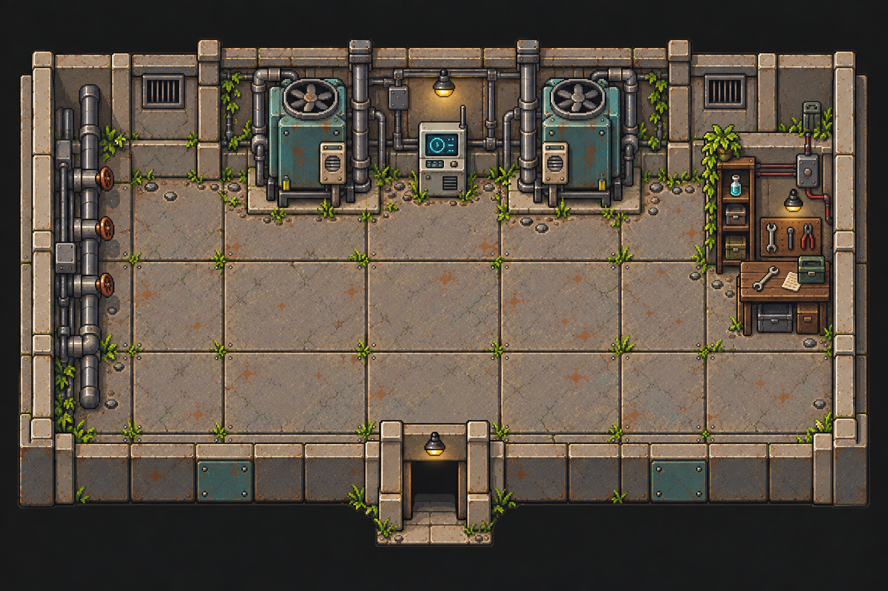
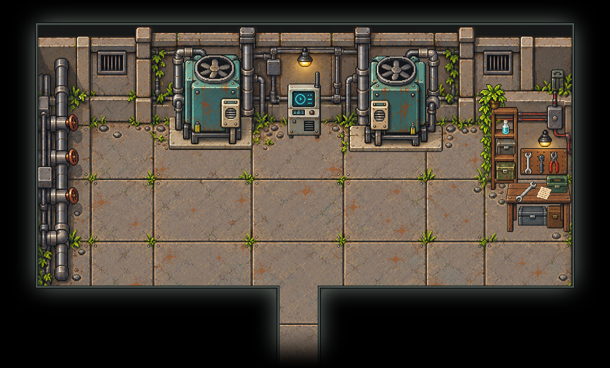

# 冷却柱机房 · 独立设备与原位装修

`low-cooling-room`
接入18件独立物件，沿用原图两台冷却机、中央控制终端与右侧维修区的布局。通过返回门连接
`low-service-duct`。原始房间图、围墙空背景和现有黑框背景保留原文件。

## 拆分内容

| 区域     | 件数 | 内容                                                             |
| -------- | ---- | ---------------------------------------------------------------- |
| 冷却设备 | 3    | 左右冷却机组、中央控制终端                                       |
| 补给架   | 5    | 空架、垂藤盆栽、浅蓝瓶、灰箱、橄榄色箱                           |
| 维修台   | 10   | 桌体、空工具板、板上3把工具、桌面扳手、纸张、工具箱、桌下2个箱子 |

冷却机的风扇、机身、前控制面板、自身连接支管与安装底座保持为同一设备；大主干立管、左侧阀门、墙面线缆、通风口和固定灯具属于背景。工具板和台面小物均可分别摆放。

正式透明PNG唯一存于
[`public/assets/low-cooling-room/`](../../../public/assets/low-cooling-room/)，两套 `layout*.json`
共用物件，记录位置、尺寸、局部脚点、支承物绘制顺序和占地来源。`overview.png`
从正式PNG回拼，未叠加人物。

## 来源与补全

原始来源为 `project-myrmidon-map-prototype/source/imagegen-v2/assets/maps/low-cooling-room.png` 和
`source/imagegen-v2/world.json`。依照
`.agents/skills/map-asset-extraction/SKILL.md`，从1536×1024原图矩形裁片逐件请求 gpt-image-2；每次一个物件和候选。首轮18件，左机组定向重做两次，右机组和维修台各重做一次，共22份图像候选。制作记录保留于本地
`art/map-study/low-cooling-room/atomic-redraw/`。

采用等比缩放与平移，按可见机身、架柱、瓶体、工具轮廓和支承接触点校准。单独检查支管、支架和工具的封闭白底，保留浅色控制面板、玻璃、纸张和金属高光。

大立管遮住的安装底座、盆栽后的架体、台面小物下的木纹以及桌沿遮住的箱盖属于推断补全。垂藤内部盆体和箱子隐蔽背缘证据较少；底座与细部保留生成复原的差异，不声称逐像素恢复原物。

## 场景接入

黑框继续使用1536×928背景与48×29格地图，保留 `[96,64,1440,720)`
内沿、南侧通道、返回门和到达点。左侧固定管线区域继续排除在可行走区外。两套布局启用来源中的 `solid-0`
至 `solid-4` 五处设备／家具占地，架上、板上和桌上物件按支承物设置绘制深度。

运行 `python scripts/export-room-maps.py` 导出。切回围墙版时在 `art/room-maps.json` 为本房选择
`layout.json`。需要新时间线加载设备与碰撞；本轮只接入显示和占地，未新增维修、取物、终端操作或剧情交互。

## 核对范围

逐件查看原图、深浅底与原位叠放，并查看围墙／黑框整房回拼。正式PNG与制作透明PNG核对尺寸、RGBA像素一致；导出器通过26房间、54个单向出口、到达锚点及32个NPC实例的连通和占位校验。

未运行Jest、完整测试、构建或实机试玩。贴设备行走、人物遮挡和与固定主干管线的视觉接合仍需游戏内验收。
