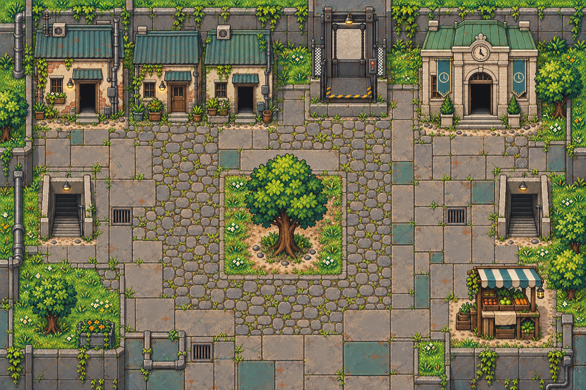
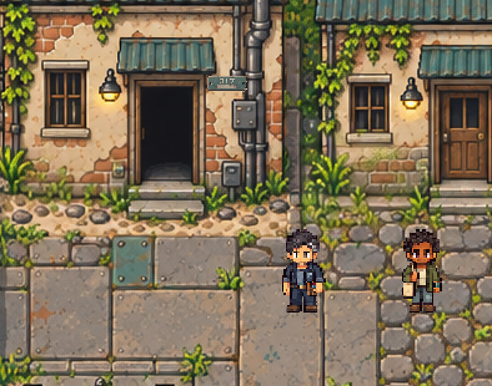

# 下层回廊 · 房间底图与布局

`low-deck` 连接 404 号舱、公共厨房、基础诊所等房间，是下层区域的连接场景。

- [`background.png`](../../../public/assets/low-deck/background.png)：1536 ×
  1024 空背景，移除独立树木、摊位、盆栽和散放容器，保留建筑、门、电梯、楼梯、道路、围墙、固定管线、地面植被与墙面藤蔓。
- [`layout.json`](../../../public/assets/low-deck/layout.json)：`sourceLayout`
  原样保存来源地图的布局，包括出口、到达点、出生点和事件锚点，坐标为原图像素。
- `room-layout.png`：原始地图，作为建筑、透视、出口及后续物件取材参考。

使用 gpt-image-2 补绘被移除物件遮挡的地面和墙面，再仅在指定修补区域合成；范围外保持原始像素。已查看最终底图，核对输出尺寸及范围外像素一致。隐蔽地面属于推断重建，尚未进行游戏内通行验收。

`sourceLayout` 是来源资料，不是游戏运行时配置。其 `image`
仍指向原始地图；碰撞与遮挡包含旧物件范围，接入空场景时需要重算，不能原样启用；物品和事件锚点也不代表已实现任务。跨房间连接按
`target` 和 `targetExit` 查找，落点取目标出口的 `arrival`。

来源：`project-myrmidon-map-prototype/source/imagegen-v2/assets/maps/low-deck.png` 与同目录上级的
`world.json`。制作提示词、补绘候选、修补范围、对照图及脚本保存在本地 `art/map-study/low-deck/`。

## 317 消磁门牌

- 标准资产：[`door-tag-317.png`](../../../public/assets/low-deck/door-tag-317.png)，64×24 RGBA PNG。
- 使用共享 Responses 脚本调用
  `gpt-image-2`，附现有回廊背景作为画风与相机参考，首轮一次生成。它是新增剧情物件，不是原图已有门牌的提取或复原。
- 实际生成图为1536×1024；从 `[371,345,1165,647)`
  裁出物件，最近邻等比缩小并取整至64×24。仅移除边缘连通白底和人工确认的两个安装孔内部白底，保留浅色姓名栏与金属高光。数字317、擦除姓名栏和右侧缺口保留，不含住户姓名。
- `layout.json.objects` 中的 `door-tag-317` 挂在像素 `[262,211]`（左上角），显示尺寸
  `[32,12]`，局部锚点
  `[16,12]`；位于404出口右侧的墙面。沿用正面素材，长边水平、短边竖直，与该墙面方向一致，仅等比缩小，不作旋转或透视拉伸。`depth:0`
  是此前静态摆放的图层配置；本次通过布局的 `entity`
  转为交互实体，sprite 仍显示在原位置，深度随逻辑格 `[8,10]`
  计算。门牌是调查旧物，不改变该入口通往404的配置。
- 已查看生成原图、深浅底透明预览及按实际比例合成的回廊局部图，并叠加 Ash 与门口住户的待机图核对初始遮挡（不含玩家）；未运行浏览器试玩。当前已接入靠近高亮、查看、记录、按步骤取下和柜中暂存；暂存完成后不再显示“暂时不放”。
- 本次挂墙调整未重新生成素材；已查看墙面摆放与 NPC 待机图的合成预览，地图导出器完成26房间连接与出口可达检查。未运行浏览器试玩，预览不是实机截图。
- 交互实体 `low-deck.door-tag-317` 占据墙前 `[8,10]`；默认相邻交互之外允许站在路面
  `[7,11]`、`[9,11]`
  查看，`[8,11]`沿用默认相邻交互。拿取后实体离场、路面格释放，原墙体`[8,9]`继续阻挡。旧静态图层移除，避免同一门牌绘制两遍。任务与对白位于
  `stories/s01-door-tag.json`。
- 内容版本为 `room-world-7-s01-guided-2`，需开启新时间线加载；旧存档仍保留原内容。

提示词、生成原图、去底脚本与调试预览保留在本地 `art/map-study/s01-door-tag/`，不随Git提交。
