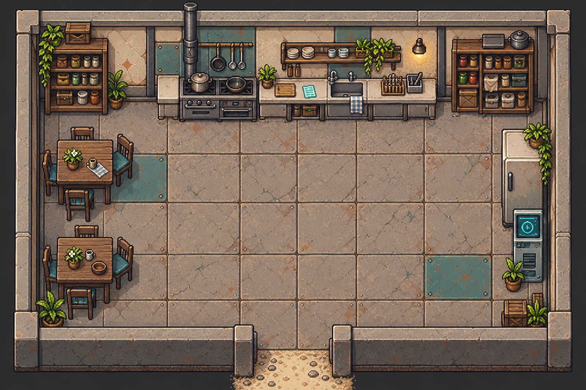
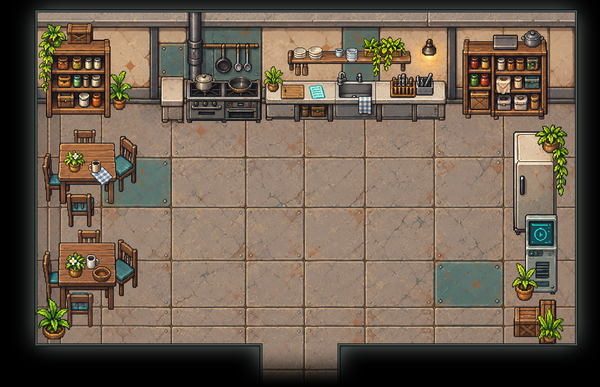

# 公共厨房 · 独立物件与原位装修

公共厨房 `low-kitchen`
接入46件独立PNG，按原始房间的家具分布、朝向和可见结构回拼。原图、围墙版空背景与黑框版空背景均保留；两套布局使用同一批独立物件。

## 物件拆分

| 区域       | 数量 | 独立内容                                                                       |
| ---------- | ---- | ------------------------------------------------------------------------------ |
| 左右储物柜 | 7    | 两个带原内部存货的柜体、左柜顶箱、垂藤、柜旁盆栽、右柜顶托盘与锅               |
| 灶台       | 3    | 炉灶、左侧带盖锅、右侧双短柄浅锅                                               |
| 水槽与壁架 | 12   | 水槽台、壁架、两叠盘子、杯、叠杯、架上盆栽、台上盆栽、砧板、便笺、刀架、厨具筒 |
| 两套餐桌椅 | 16   | 两张桌、八把椅、两盆桌花、两个杯子、格布与木碗                                 |
| 右侧设备   | 4    | 冰箱、冰箱顶垂藤、终端、终端旁盆栽                                             |
| 南侧角落   | 4    | 西南盆栽、东南前箱、后方窄箱、东南盆栽                                         |

柜内存货随柜体保留；水槽、龙头、柜下储物和挂巾随水槽台保留。桌面与柜顶小物分别输出，壁架与架上物件分别输出。烟道、挂杆厨具、墙灯及石质固定部分仍属于背景。

- [`public/assets/low-kitchen/`](../../../public/assets/low-kitchen/)：每件唯一正式PNG；`layout.json`
  与 `layout-box.json` 记录位置、尺寸、脚点及图层顺序。
- `room-layout.png`：1536×1024原图，来源
  `project-myrmidon-map-prototype/source/imagegen-v2/assets/maps/low-kitchen.png`。
- `overview.png`：从正式PNG回拼的黑框房间，未叠加人物。

## 制作依据与限制

按 `.agents/skills/map-asset-extraction/SKILL.md`
从原始矩形裁图逐件请求 gpt-image-2，首轮46次；浅锅、水槽台和窄箱各定向重试一次，壁架重试两次，共51次图像请求。原始裁图、提示词、生成结果、逐件深浅底及原位对照、分层制作脚本留在本地
`art/map-study/low-kitchen/atomic-redraw/`。

保留原有家具朝向，只使用等比缩放和平移进行对齐；按桌柜可见宽度、椅柱可见高度和壁架前缘校准。生成素材保持来源风格与布局，但不是原可见像素的逐像素复制。封闭椅背缝、把手孔和无白色材质的叶片间隙经查看后去底，保留白色花瓣、陶瓷和金属高光。

桌子遮住的椅座／椅腿、终端遮住的冰箱底部、盆栽遮住的终端面板，以及前墙遮住的角落箱体／花盆为推断补全。其中两把后排椅的下部、垂藤遮住的花盆、东南窄箱和东南盆体证据较少，不作为原样恢复承诺。原图回拼位置以可见结构为基准，补全后的完整轮廓允许伸入原先被遮挡的范围。

## 场景接入

默认继续使用黑框版。为容纳原家具位置，厨房黑框内沿扩为 `[96,32,1472,880)`，南侧通道为
`[672,880,864,992)`；空地板窄边和底边使用邻近条带补接。围墙版背景及原始建筑／通行来源数据保持原内容。

两套布局声明相同物件列表及原布局的10个家具占地区域。`objects[].depth`
可显式指定源资产图层深度，导出器优先采用它，使架上、台上和柜顶物件随支承物正确叠放。它仅是美术导出字段，不增加运行时交互能力。

运行 `python scripts/export-room-maps.py`
导出场景。新时间线加载装修、家具碰撞和地图边界；已有时间线保留原场景配置。本轮仅恢复显示与占地，尚未增加烹饪、取物、开柜、终端操作或入座行为。

## 核对情况

已查看46件原始裁图、深浅底及原位叠放预览，核对整房原图／围墙回拼／黑框回拼；正式PNG与制作透明PNG尺寸和RGBA像素一致。导出器通过26房间连通性、54个单向出口、到达锚点及32个NPC实例的占位与出口可达检查。

尚未实机试玩或逐像素手工精修，未运行Jest、完整测试或构建。地板条带接缝、贴家具行走和物件遮挡需在游戏缩放下继续验收。
