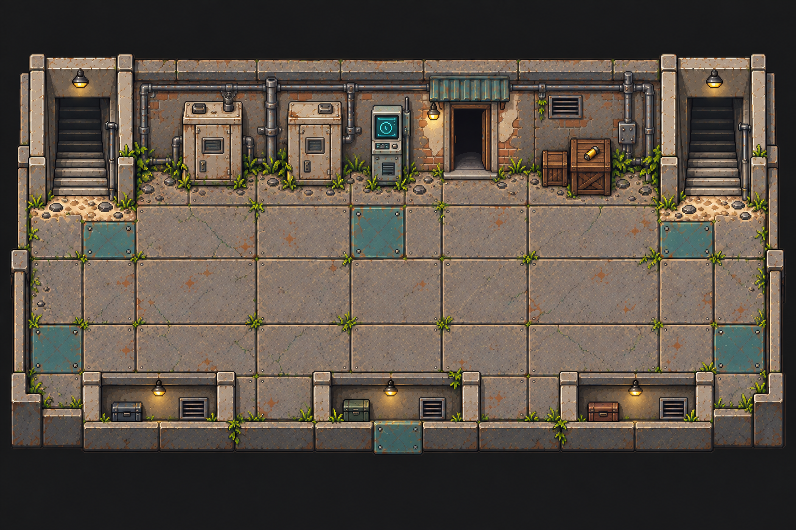

# 维修捷径 · 房间底图与布局

`low-service-duct` 为下层区域的维修通道，连接信息保存在来源布局中。

- [`background.png`](../../../public/assets/low-service-duct/background.png)：1536 ×
  1024 空背景，移除两台柜体、终端、木箱及南侧壁龛储物箱，保留两侧楼梯、中间门口、固定管线、壁灯、通风口、墙体和地面。
- [`layout.json`](../../../public/assets/low-service-duct/layout.json)：`sourceLayout`
  原样保存来源地图的出口、到达点、出生点与事件锚点，坐标为原图像素。
- `room-layout.png`：原始地图，用于建筑、透视和后续物件取材参考。

使用 gpt-image-2 补绘隐藏墙面与地面，仅在指定修补区域采用生成内容；范围外保持原始像素。已查看最终底图并核对尺寸与范围外像素一致。被柜体遮挡的墙面、管线与地面包含推断重建，尚未进行游戏内通行验收。

`sourceLayout` 是来源资料，不是游戏运行时配置。其 `image`
指向原始地图；旧物件碰撞和遮挡范围需要在空场景接入时调整，事件锚点不代表任务已实现。跨房间按
`target` 与 `targetExit` 查找连接，落点取目标出口的 `arrival`。

来源：`project-myrmidon-map-prototype/source/imagegen-v2/assets/maps/low-service-duct.png` 与
`source/imagegen-v2/world.json`。制作提示词、候选、修补遮罩和对照图保存在本地
`art/map-study/low-service-duct/`。
