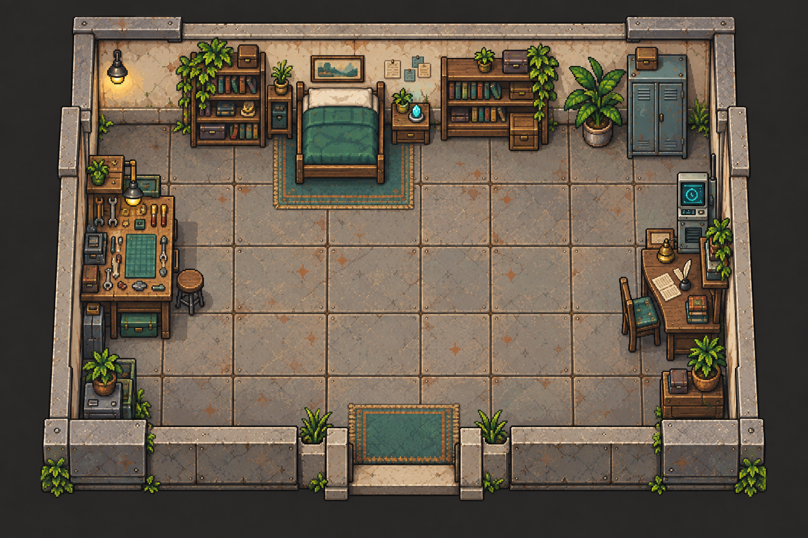
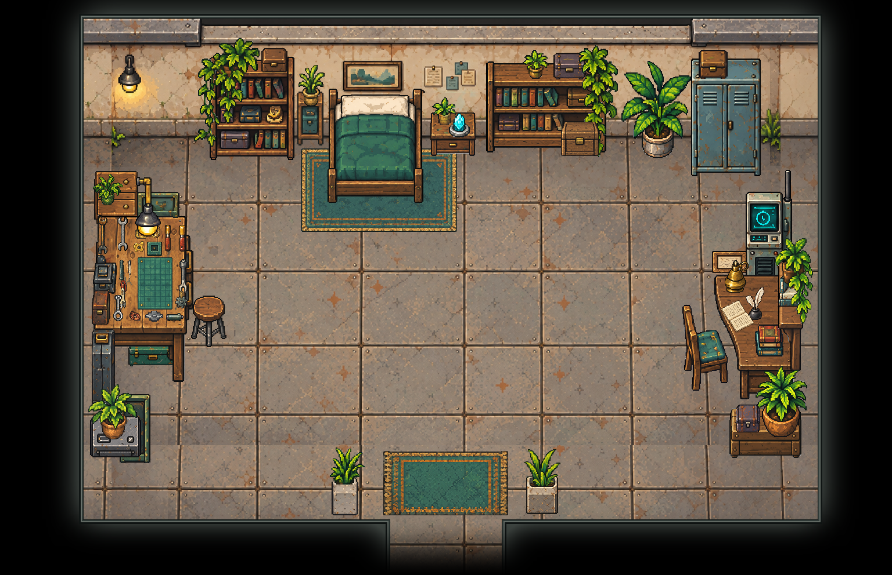

# Rhea 的藏时铺 · 独立物件与原位装修

`rhea-den` 的床区、工具台、书桌和储物区拆为66件独立物件，按原图布局回拼。房间仍通过门连接下层回廊
`low-deck`。原始布局图和围墙版空背景保留原文件，两套布局共用物件。

## 拆分内容

| 区域           | 件数 | 内容                                                                         |
| -------------- | ---- | ---------------------------------------------------------------------------- |
| 床区           | 7    | 床、床下地毯、窄床头柜与盆栽、右床头桌与盆栽及晶体灯                         |
| 北侧书柜与储物 | 11   | 两组书柜、柜顶盆栽与箱子、柜前木箱、大盆栽、金属柜及顶箱                     |
| 工作台         | 28   | 桌体、小木柜、盆栽、挂灯、相框、凳子、箱体、设备、垫板及17件独立工具／零件   |
| 书桌与中继器   | 11   | 桌、椅、中继终端、灯、展开的书、羽毛笔墨水瓶、书摞、边架、架上书、垂藤、相框 |
| 南侧角落       | 6    | 东南大箱、小箱与盆栽；西南设备、后立板与盆栽                                 |
| 入口           | 3    | 地垫、左右石盆植物                                                           |

书柜内部的书、盒和陈设随柜保留，柜顶物件独立；床架与床品为一件，花盆与植物为一件，墨水瓶与羽毛笔为一件。工作台桌体不包含散放工具与垫板。建筑、北墙灯、挂画及便笺沿用空背景。

正式透明PNG唯一存于 [`public/assets/rhea-den/`](../../../public/assets/rhea-den/)，`layout.json` 与
`layout-box.json` 记录位置、尺寸、局部脚点、绘制深度与占地来源。`overview.png`
从正式PNG回拼，未包含人物。

## 来源与补全

来源为 `project-myrmidon-map-prototype/source/imagegen-v2/assets/maps/rhea-den.png` 与
`source/imagegen-v2/world.json`。按
`.agents/skills/map-asset-extraction/SKILL.md`，从1536×1024原图保留周边上下文的矩形裁片逐件请求 gpt-image-2；每次一个物件、一个候选。制作计划、裁图、提示词、尝试记录和深浅底预览保留在本地
`art/map-study/rhea-den/atomic-redraw/`。

首轮66次，针对桌柜比例、木柜可见结构及两件异形工具的原始方向重做9次，共75次图像请求；书桌和边架另附整房图作相机参考。按可见宽度、床／椅／桌架支柱高度及地毯前沿等比缩放和平移，不作非等比拉伸。清理植物、椅腿、支架、工具和灯把手的封闭白底，同时保留书页、羽毛、晶体及金属高光。

床下大面积地毯、植物下的柜面、椅子后的桌腿、木箱后的书柜局部等为推断补全。垂藤隐藏的盆体、西南设备后立板和金属窄箱的隐蔽部分、入口前墙挡住的石盆下半部证据较少；这些形状属于可编辑的低置信度复原，不是原像素的精确恢复。细小工具的名称按视觉用途归类，其设计以原裁片为依据。

## 场景接入

黑框内沿为 `[144,32,1408,896)`，南通道为
`[672,896,864,992)`，最终背景1536×992，对应48×31格。扩出的窄边、底部及通道由邻近空地板条带补接，以保留原物件摆放坐标；纹理重复及接缝仍需在游戏缩放下验收。

启用来源布局14个家具占地区域，另补工作台后小柜、窄金属箱与两盆入口植物的4个地面占地区域。桌上物件按支承家具设置绘制深度；垂藤和工作灯分别保持在书本、相框之前。地毯位于人物下方，不阻挡行走。

返回门使用第30行（0起算）的6个格子，通道尽头与相机画布下缘对应；保留原到达锚点及目的地。切回围墙版时在
`art/room-maps.json` 为本房选择 `layout.json`，再运行 `python scripts/export-room-maps.py`。原
`sourceLayout` 出口像素保留来源依据，实际黑框触发格以该布局的 `portalPlacement` 为准。

需新建时间线加载家具、占地、门和地图尺寸。本轮恢复显示与阻挡，不新增取用工具、修理、中继器操作、睡眠或对白。

## 核对范围

逐件核对原图、深浅底与原尺度叠放，查看围墙／黑框整房回拼。正式PNG与制作透明PNG核对尺寸和RGBA像素一致。导出器通过26房间、54个单向出口、到达锚点及32个NPC实例的连通和占位校验。

未运行Jest、完整测试、构建或实机试玩。人物遮挡、贴家具行走、相机边界与新增地板接缝尚待游戏内验收；围墙版仍需核对前墙与完整补出盆体的遮挡关系。
