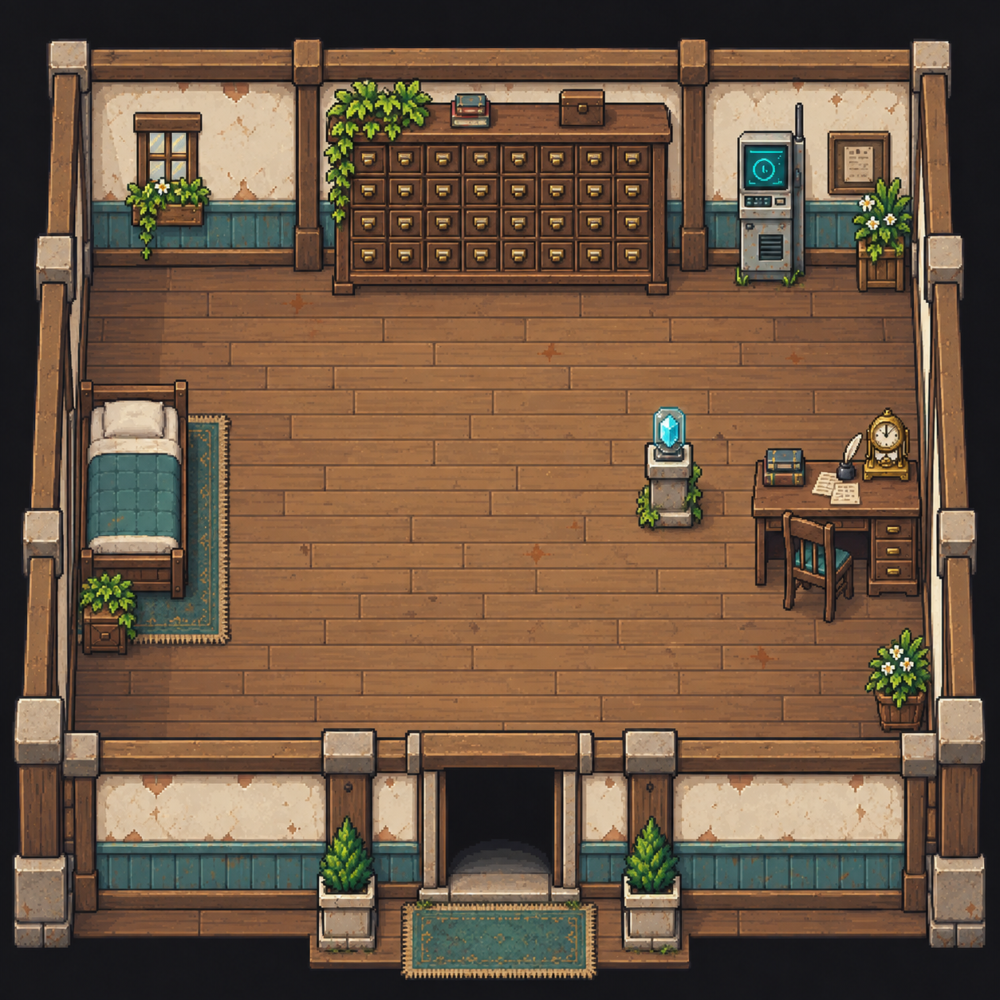
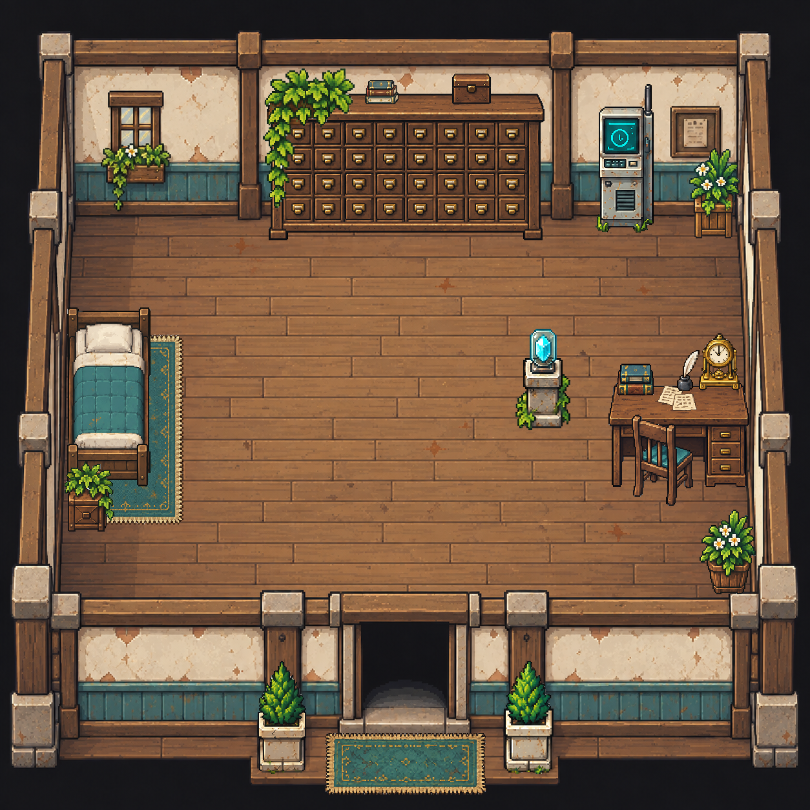

# 404 号舱 · 独立物件与房间布局

默认 `just dev` 从此房间开始，内容入口为
[26 房间内容包](../../../public/content/remaining-time/README.md)。南侧出口连接下层回廊。

## 黑框版本（当前默认）

原围墙版 `background.png`、`layout.json`、物件 PNG 和 Aseprite 全部保留。黑框版使用独立的
[`background-box.png`](../../../public/assets/unit-404/background-box.png) 与
[`layout-box.json`](../../../public/assets/unit-404/layout-box.json)，20 件物件共用原 PNG；仅入口两盆植物与门垫改放至室内。

黑框背景由已有像素裁切、地板条带补接和程序边框合成，保留北侧背墙。墙沿由细描边、灰绿截面和向外衰减的高斯柔影组成，门口地板逐渐暗至黑色；传送格使用透明
`portal-box.png`，入口由背景阴影提示。黑框不作为遮挡人物的前景层。背景与地图统一为 1280×1056（40×33格），下缘即通道末端，现有相机 clamp 在此停止下移；美术场景画布底色使用黑色。矩形地板为
`[96,344,1184,928)`，南侧通道为
`[544,928,704,1056)`，坐标为来源像素。新增植物占地与五格宽出口随黑框布局加载；返回落点为
`[19,28]`，出口触发位于第31行。

`art/room-maps.json` 的 `layoutFiles.unit-404` 当前选择 `layout-box.json`；改为 `layout.json` 并运行
`python scripts/export-room-maps.py` 可恢复原背景、摆放、碰撞与入口配置。布局可声明
`collisionIds`、`portalPlacement` 和 `contentVersion`，省略时沿用公共配方。黑框场景版本为
`room-world-1-box-404-2`；S01强引导版本已更新为`unit-404-s01-guided-2`，需开启新时间线；旧档仍保留嵌入的地图尺寸、碰撞及入口配置。

候选对照已查看，正式布局的门口与占地仍需实机验收。制作脚本、独立黑框层与补接记录保留在本地
`art/map-study/unit-404/box-room/`；窄边和门口的地板条带属于补接像素。

## 运行与制作文件

- [`background.png`](../../../public/assets/unit-404/background.png)：沿用的空房间底图。
- [`layout.json`](../../../public/assets/unit-404/layout.json)：原始 `sourceLayout`
  与当前 20 件独立物件的图片、位置、尺寸、局部脚点和 Aseprite 引用。
- `*.aseprite`：各件的可见物件层与隐藏原图参考层；导出 PNG 位于 `public/assets/unit-404/`。
- `room-layout.png`：未改动的来源原图；`overview.png`：按原图尺度回拼的物件预览。
- [`art/room-maps.json`](../../room-maps.json)：地图导出配方；来源像素转成 32px 网格，保留原始家具地面占地。

20 件物件分别为：抽屉柜、柜顶垂吊盆栽、柜顶书本、小箱子、终端、北侧白花盆栽、床、床下地毯、床边盆栽、水晶展台、书桌、椅子、桌面书本、座钟、墨水瓶与羽毛笔、纸张、南侧桶盆栽、入口左右盆栽和门垫。

物件以独立 `map.art`
图层加载；地毯在地板层，柜顶和桌面小物跟随支撑家具的深度排序。床、书桌纸张与北侧柜体在当前黑框布局中已转为交互实体。纸张用于S01第三步旧记录，逻辑格`[33,23]`，允许站在桌面上方、下方及左右多个指定位置阅读；柜体用于第六步暂存，逻辑格`[19,11]`，可从长边上下两侧多个位置靠近。外观位置保持原图，柜顶小物按柜体实体的深度加1绘制，避免转为实体后被柜体遮住。暂存通过扣除背包门牌并记录固定保管事实实现，不提供通用容器或取回。碰撞由来源布局的家具占地生成，独立 PNG 不按透明边界自动产生碰撞。

## 生成与核对

从 1254 ×
1254 原图按矩形裁框取材，以 gpt-image-2 逐件生成。床下地毯和书桌各定向重试一次，共 22 次请求。已查看 20 件的原图对照、深浅底、位置叠加和整体回拼；清理椅子／座钟封闭空隙与外缘白底污染。独立 Aseprite 导出的尺寸与 RGBA 像素和相应 PNG 一致。

床下地毯的大面积花纹、柜顶盆栽的隐藏盆体，以及被植物或椅子挡住的家具结构属于推断补全。柜体顶面、书桌桌面深度及内侧结构、部分纹理与原图仍有差异，未宣称逐像素还原；游戏内人物比例、碰撞与遮挡仍待实机验收。柜顶盆栽的锚点按盆底在柜面上的支承点估计，不以垂藤末端落地。

来源：`project-myrmidon-map-prototype/source/imagegen-v2/assets/maps/unit-404.png` 与
`world.json`。裁图、提示词、生成原图、重试候选和逐件检查记录保留在本地
`art/map-study/unit-404/atomic-redraw/`。
